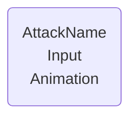
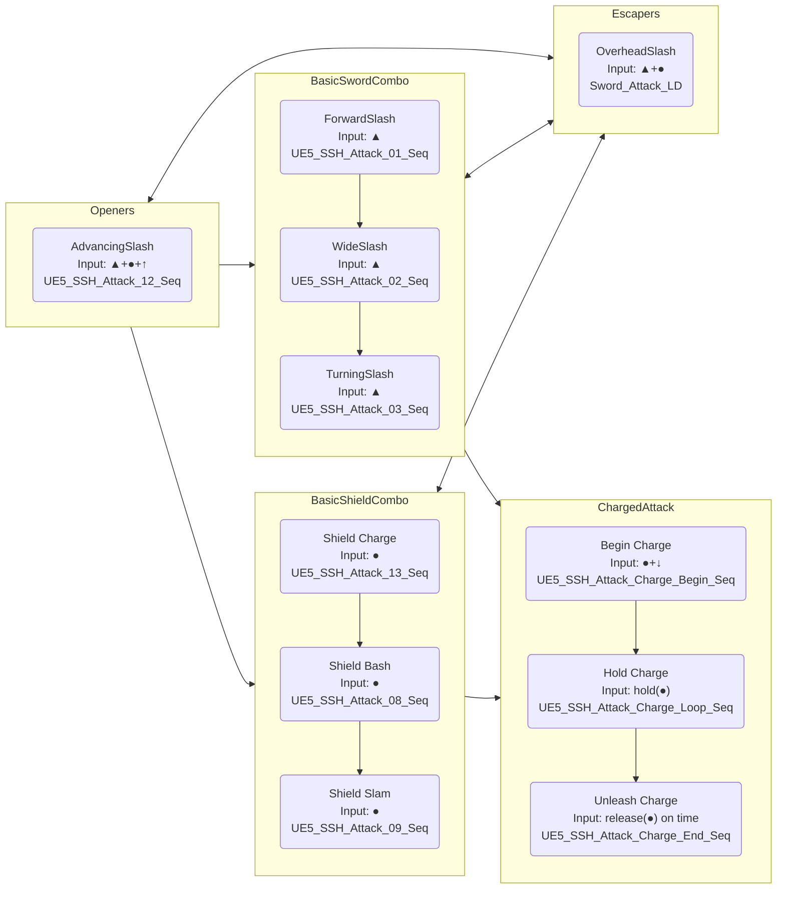
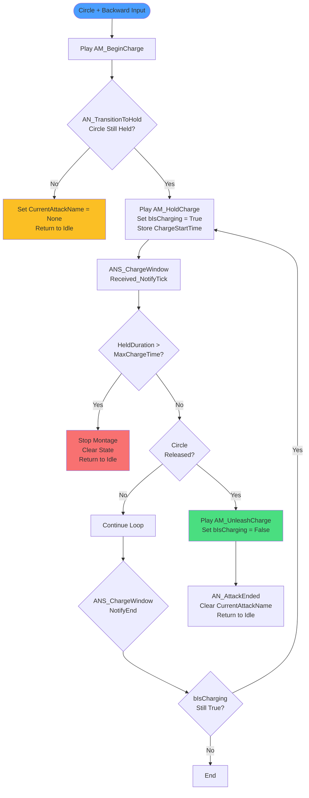

# Combat System

## Combo-chain

---

### Template



### MVP Combo chain


# AttemptCombo Function

## Overview

**Location:** BP_ThirdPersonCharacter Functions  
**Type:** Function  
**Purpose:** Handles all combo logic by querying data tables to determine valid attack transitions and executing the appropriate animation.

---

## Function Signature

**Input:**

- `InputAction` (E_InputAction enum) - The detected input from ProcessCombatInput()

**Output:**

- None (void function)

---

## Function Flow

### High-Level Logic
```
AttemptCombo(InputAction)
    ↓
Query DT_Combos for valid transition
    ↓
If valid transition found:
    ├─ Query DT_Attacks for animation data
    ├─ Play animation montage
    └─ Update combat state
```

---

## Detailed Implementation

### Step 1: State Check

**Branch: Is CurrentAttackName == None?**

- **True:** Character is in neutral state (not attacking)
  - Search for valid **starter moves** (FromAttack = None)
  
- **False:** Character is mid-combo
  - Search for valid **transitions** (FromAttack = CurrentAttackName)

Both paths lead to the same table query logic.

---

### Step 2: Query DT_Combos for Valid Transition

**Get Data Table Row Names** from `DT_Combos`
  ↓
**For Each Loop With Break** (iterate through all combo rows)
  ↓
For each row:

1. **Get Data Table Row** from `DT_Combos`
2. **Break S Combo Transition** (extract struct fields)
3. **Check conditions** (AND node):
   - `CurrentAttackName == FromAttack` (or both None for starters)
   - `InputAction (function input) == InputAction (table)`
4. **If BOTH TRUE:**
   - **Set local variable:** `FoundCombo = ToAttack`
   - **Break loop** (valid transition found, stop searching)

**Loop Completed** (all rows checked)
  ↓
**Branch: Is FoundCombo != None?**

---

### Step 3A: Valid Transition Found (FoundCombo != None)

**Get Data Table Row** from `DT_Attacks`

- Row Name: `FoundCombo`
  ↓
**Break S Attack Data** (extract attack properties)
  ↓
**Play Anim Montage**
- Anim to Play: `AttackMontage` (from struct)
  ↓
**Set CurrentAttackName** = `FoundCombo`
  ↓
**Set bCanCombo** = False (prevent input until combo window opens via ANS)
  ↓
**Return**

---

### Step 3B: No Valid Transition (FoundCombo == None)

**Do nothing** (invalid input for current state)
  ↓
**Return**

---

## Data Table Dependencies

### DT_Combos (Combo Transitions)

| Column | Type | Description |
|--------|------|-------------|
| FromAttack | E_AttackName | Starting attack (None = neutral state) |
| ToAttack | E_AttackName | Resulting attack |
| InputAction | E_InputAction | Required input to trigger transition |

**Example Rows:**
```
None → ForwardSlash (LightAttack)           // Neutral starter
ForwardSlash → WideSlash (LightAttack)      // Combo continuation
ForwardSlash → OverheadSlash (LightAndHeavy) // Escaper transition
```

---

### DT_Attacks (Attack Properties)

| Column | Type | Description |
|--------|------|-------------|
| AttackName | E_AttackName | Unique attack identifier |
| AttackMontage | Anim Montage | Animation to play |
| BaseDamage | Float | Attack damage value |
| AttackType | Enum | Attack category |
| ... | ... | (other attack properties) |

---

## State Variables Used

| Variable | Type | Read/Write | Purpose |
|----------|------|------------|---------|
| `CurrentAttackName` | E_AttackName | Read/Write | Tracks active attack for transition queries |
| `bCanCombo` | Boolean | Write | Prevents input spam (reset by ANS_ComboWindow) |
| `FoundCombo` | E_AttackName (Local) | Read/Write | Stores valid transition result |

---

## Integration with Input System

**Call Flow:**
```
Event Tick (if bInputReceivedThisFrame)
    ↓
ProcessCombatInput() → Returns E_InputAction
    ↓
AttemptCombo(DetectedInput)
    ↓
Queries tables → Plays attack
```

**Guard Conditions** (checked before AttemptCombo is called):

- `(CurrentAttackName == None) OR (bCanCombo == True)`
- Prevents invalid combo attempts outside combo windows

---

## Design Patterns

### Data-Driven Architecture

**All combo logic lives in data tables**, not Blueprint:

- ✅ Add new attacks: Add row to DT_Attacks
- ✅ Add new transitions: Add row to DT_Combos
- ✅ Modify combos: Edit table rows (no code changes)
- ✅ Balance damage: Update DT_Attacks values

### Normalized Structure

**Separation of concerns:**

- **DT_Combos:** "Which attacks connect?"
- **DT_Attacks:** "What are the attack properties?"

No data duplication - attack properties stored once in DT_Attacks.

### Early Exit Pattern

**For Each Loop With Break** stops searching once valid transition is found:

- ✅ Performance: Doesn't check every row unnecessarily
- ✅ Clarity: First valid match wins (priority by row order)

---

# Charge Attack System

## Overview

**Status:** ✅ Complete  
**Session:** 14  
**Purpose:** Hold-and-release attack mechanic with timeout cancellation

---

## Design

The Charge Attack is a three-phase system:
1. **Begin Charge** - Windup animation (committed)
2. **Hold Charge** - Looping hold state (cancelable on release or timeout)
3. **Unleash Charge** - Release attack (damage dealer)

**Input Flow:**
```
Circle + Backward (from neutral) → Begin Charge
    ↓
Hold Circle → Transition to Hold Charge (loops)
    ↓
Release Circle → Unleash Charge
    OR
Hold too long (3s) → Cancel to idle
```

---

## Implementation

### Data Tables

**DT_Combos:**
```
FromAttack: None
ToAttack: BeginCharge
InputAction: HeavyAndBackward
```

**DT_Attacks:**
- `BeginCharge` - Entry animation
- `HoldCharge` - Looping hold animation
- `UnleashCharge` - Release attack animation
Added column at session 13.11.2025:
- `AttackingWeapon` (E_WeaponType enum) - Sword or Shield
Determines which hitbox activates during attack.


---

## Animation Montages

### AM_BeginCharge

**AnimNotifies:**
- **ANS_LockInput** - Prevents other actions during windup
- **AN_TransitionToHold** (at end) - Checks if button still held, transitions to hold or cancels

**Purpose:** Entry animation that commits player to charge state

---

### AM_HoldCharge

**AnimNotifies:**
- **ANS_LockInput** - Prevents actions during hold
- **ANS_ChargeWindow** (full duration) - Monitors button release and timeout

**Looping:** Manual replay via ANS_ChargeWindow Received_NotifyEnd

**Purpose:** Visual hold state while charging, loops until released or timeout

---

### AM_UnleashCharge

**AnimNotifies:**
- **ANS_LockInput** - Prevents actions during unleash
- **AN_AttackEnded** (at end) - Clears CurrentAttackName, returns to idle

**Purpose:** Payoff attack when charge is released

---

## Custom AnimNotify: AN_TransitionToHold

**Type:** AnimNotify (single event)  
**Location:** End of AM_BeginCharge  
**Purpose:** Bridge between Begin and Hold phases

### Logic:
```
Received_Notify
    ↓
Get Owning Actor (cast to BP_ThirdPersonCharacter)
    ↓
Branch: Is bHeavyPressed True? (Circle still held?)
    ├─ True → Transition to Hold
    │   ├─ Set CurrentAttackName = HoldCharge
    │   ├─ Set bIsCharging = True
    │   ├─ Set ChargeStartTime = Get Game Time in Seconds
    │   └─ Play Anim Montage: AM_HoldCharge
    │
    └─ False → Quick Release (button released during windup)
        ├─ Set CurrentAttackName = None
        └─ Set bIsCharging = False
        └─ (Returns to idle naturally)
```

**Why This Exists:** Player might release button during windup - this detects and handles early release gracefully.

---

## Custom AnimNotifyState: ANS_ChargeWindow

**Type:** AnimNotifyState (Begin/Tick/End)  
**Location:** Spans entire AM_HoldCharge  
**Purpose:** Monitor hold state, detect release or timeout

### Received_NotifyBegin:
```
(Empty - state initialization happens in AN_TransitionToHold)
```

### Received_NotifyTick:

**Runs every frame during hold, checks two conditions in priority order:**
```
1. Check Timeout FIRST:
   Get Game Time - ChargeStartTime = HeldDuration
       ↓
   Branch: HeldDuration > MaxChargeTime? (3.0 seconds)
   ├─ True → FORCE CANCEL
   │   ├─ Stop Anim Montage (Get Current Active Montage)
   │   ├─ Set CurrentAttackName = None
   │   └─ Set bIsCharging = False
   │
   └─ False → Continue to release check

2. Check Release:
   Branch: Is bHeavyPressed False? (Circle released?)
   ├─ True → UNLEASH
   │   ├─ Set bIsCharging = False
   │   ├─ Set CurrentAttackName = UnleashCharge
   │   └─ Play Anim Montage: AM_UnleashCharge
   │
   └─ False → Do nothing (keep holding)
```

**Why This Order:** Timeout check must run first to force cancel even if button is still held. Release check runs second to detect player input.

### Received_NotifyEnd:

**Manual Loop Implementation:**
```
Branch: Is bIsCharging True?
├─ True → Replay Hold Animation
│   └─ Play Anim Montage: AM_HoldCharge
│       (Creates manual loop - simpler than montage section loops)
│
└─ False → Do nothing (charge was released/canceled)
```

**Why Manual Loop:** UE5's montage section looping was unreliable. Manual replay in NotifyEnd provides explicit control and works consistently.

---

## State Variables

**Added to BP_ThirdPersonCharacter:**

| Variable | Type | Default | Purpose |
|----------|------|---------|---------|
| `bIsCharging` | Boolean | False | Tracks if player is in charging state |
| `ChargeStartTime` | Float | 0.0 | Game time when charge began (for duration calc) |
| `MaxChargeTime` | Float | 3.0 | Timeout duration in seconds |

**Existing Variables Used:**
- `bHeavyPressed` - Monitors Circle button state
- `CurrentAttackName` - Tracks current charge phase

---

## Flow Diagram


---

## State Machine
```
Idle
  ↓ (Circle+Back)
BeginCharge (0.0-1.0s)
  ↓ (if still holding)
HoldCharge (loops until...)
  ├─ Released → UnleashCharge → Idle
  ├─ Timeout (3s) → Idle
  └─ Early release → Idle
```

---

## Design Decisions

### Why Manual Loop Instead of Montage Sections?

**Attempted:** UE5's built-in montage section looping (Next Section Name, Loop checkboxes)  
**Result:** Inconsistent behavior, sections not editable as expected  
**Solution:** Manual replay in Received_NotifyEnd

**Trade-offs:**
- ✅ Explicit control over loop behavior
- ✅ Easy to debug (clear execution path)
- ✅ Works consistently
- ❌ Slightly more Blueprint nodes than native solution
- ❌ Potential edge case if NotifyEnd fires unexpectedly

**Verdict:** Manual loop is simpler and more reliable for prototyping. Can optimize later if needed.

---

### Why Timeout Check Before Release Check?

**Priority Order:**
1. Timeout (force cancel)
2. Release (player action)

**Reasoning:** Timeout must override player input. If player holds button for 4 seconds, the timeout should cancel even if they're still holding. If release check runs first, it would skip timeout logic.

---

### Why Check Button State in AN_TransitionToHold?

**Problem:** Player might release button during BeginCharge animation (early release).

**Solution:** At end of BeginCharge, check if button is still held:
- Held → Transition to HoldCharge
- Released → Cancel gracefully to idle

**Without this check:** Would transition to HoldCharge even after release, requiring immediate unleash (feels wrong).

---

## Future Enhancements

### Perfect Release Timing (Planned)

**Design:**
- Hold duration between 1.0-1.5 seconds = Perfect Release
- Outside window = Normal Release
- Visual/audio cue to indicate perfect window

**Implementation:**
```
In ANS_ChargeWindow Received_NotifyTick (when released):
├─ Calculate HeldDuration
├─ Branch: (HeldDuration >= 1.0) AND (HeldDuration <= 1.5)?
│   ├─ True → Set bLastChargeWasPerfect = True
│   └─ False → Set bLastChargeWasPerfect = False
└─ UnleashCharge checks this flag for damage multiplier
```

**Visual Cue:** Place AnimNotifies at 1.0s and 1.5s in AM_HoldCharge to trigger weapon glow/sound effects.

---

### Variable Charge Levels (Future)

**Multiple charge stages with different unleash attacks:**
- Level 1 (0-1s): Weak unleash
- Level 2 (1-1.5s): Perfect unleash (current implementation)
- Level 3 (1.5-3s): Overcharge (slower but stronger?)

**Would require:** Multiple unleash animations, stage tracking, visual feedback per stage.

---

### Stamina Cost (Future)

**Holding charge drains stamina:**
- In Received_NotifyTick: Drain stamina per frame
- If stamina depleted: Force cancel
- Adds resource management to charge timing

---

## Integration Points

### Combo System

**Entry:** Circle+Backward from neutral queries DT_Combos, finds BeginCharge, plays montage.

**No Combo Window:** Charge attacks have no ANS_ComboWindow - cannot combo out once committed.

**Reset:** AN_AttackEnded at end of UnleashCharge clears CurrentAttackName, allowing next combo input.

**Hitboxes:**
- SwordHitBox (sword attacks)
- ShieldHitBox (shield attacks)
- Weapon type defined in DT_Attacks (AttackingWeapon column)
- ANS_EnableHitBox switches on weapon type
- Self-hit filtering in overlap events

---

### Input System

**Relies on:**
- `bHeavyPressed` state tracking (IA_HeavyAttack Started/Completed)
- Directional input detection (HeavyAndBackward enum)
- Frame-buffered input processing (Event Tick)

**State Changes:**
- IA_HeavyAttack Started → Sets bHeavyPressed = True
- IA_HeavyAttack Completed → Sets bHeavyPressed = False
- ANS_ChargeWindow checks bHeavyPressed every frame

---

### Perfect Timing System (Future)

**Will integrate with existing perfect timing architecture:**
- Same variable pattern (`bLastChargeWasPerfect`)
- Same feedback systems (weapon glow, sound ding)
- Same damage multiplier application in hitbox detection

---

## Testing & Debugging

### Debug Print Locations

**For monitoring charge state:**
```
AN_TransitionToHold:
└─ "Transitioning to Hold" or "Early Release"

ANS_ChargeWindow Tick:
├─ "Still holding... Duration: {HeldDuration}"
├─ "Timeout! Canceling charge"
└─ "Button Released - Unleashing!"

ANS_ChargeWindow End:
└─ "ChargeWindow ENDED - Replaying" or "Charge Finished"
```

---

### Common Issues & Solutions

**Issue:** Charge stops at 1.5 seconds, doesn't loop

**Solution:** Manual loop in Received_NotifyEnd not implemented, or bIsCharging cleared prematurely.

**Check:**
- Is Received_NotifyEnd replaying montage when bIsCharging = True?
- Is something else clearing bIsCharging during hold?

---

**Issue:** Can't exit charge, loops forever

**Solution:** Release detection or timeout logic not firing.

**Check:**
- Is bHeavyPressed actually changing to False on release?
- Is MaxChargeTime set? Is timeout branch checking correct variable?
- Print HeldDuration to verify timeout logic runs

---

**Issue:** Charge unleashes immediately even when holding

**Solution:** bHeavyPressed not staying True during hold, or release check running when it shouldn't.

**Check:**
- Print bHeavyPressed value every frame during hold
- Is IA_HeavyAttack Completed firing unexpectedly?
- Is consumed flag interfering with button state tracking?

---

## Performance Notes

**Cost:** Negligible

**ANS_ChargeWindow Received_NotifyTick runs every frame during hold:**
- 2 float subtractions (time checks)
- 2 branch comparisons
- Cost: ~0.001ms at 60fps

**Manual loop replays montage:**
- Montage play cost: ~0.01ms
- Fires once per animation cycle (~1.5s)
- Negligible impact

---

## Design Philosophy

**This system embodies core game design principles:**

✅ **Risk/Reward** - Commit time to charge for powerful attack  
✅ **Player Agency** - Choose when to unleash vs. max charge  
✅ **Clear Feedback** - Visual loop animation shows charging state  
✅ **Failure State** - Timeout punishes overcommitment  
✅ **Skill Expression** - Future perfect timing adds mastery layer

**Inspired by:** Monster Hunter charge attacks, Dark Souls heavy attacks, fighting game charge moves

---

## Related Systems

**Upstream (triggers this system):**
- Input System (detects Circle+Backward)
- ProcessCombatInput (returns HeavyAndBackward enum)
- AttemptCombo (queries DT_Combos, plays BeginCharge)

**Downstream (called by this system):**
- Animation Montage system (plays Begin/Hold/Unleash)
- State tracking (CurrentAttackName, bIsCharging)

**Parallel Systems (independent):**
- Lock-On Camera (works during charge)
- Movement System (root motion from animations)
- Perfect Timing System (future integration point)

---

*Documented: Session 14 - Charge Attack System Complete*  
*Manual loop solution proven reliable for prototype phase*

---

## Example Execution Traces

### Example 1: Basic Combo from Neutral

**Input:** Player presses Tri from neutral
```
AttemptCombo(LightAttack)
├─ CurrentAttackName = None (neutral)
├─ Query DT_Combos:
│   └─ Find: None → ForwardSlash (LightAttack) ✓
├─ FoundCombo = ForwardSlash
├─ Query DT_Attacks:
│   └─ Get ForwardSlash properties (AM_Slash_01)
├─ Play Anim Montage: AM_Slash_01
├─ Set CurrentAttackName = ForwardSlash
└─ Set bCanCombo = False
```

**Result:** ForwardSlash animation plays, combo window opens via ANS

---

### Example 2: Combo Continuation

**Input:** Player presses Tri during ForwardSlash combo window

**Precondition:** ANS_ComboWindow set bCanCombo = True
```
AttemptCombo(LightAttack)
├─ CurrentAttackName = ForwardSlash (mid-combo)
├─ Query DT_Combos:
│   └─ Find: ForwardSlash → WideSlash (LightAttack) ✓
├─ FoundCombo = WideSlash
├─ Query DT_Attacks:
│   └─ Get WideSlash properties (AM_Slash_02)
├─ Play Anim Montage: AM_Slash_02
├─ Set CurrentAttackName = WideSlash
└─ Set bCanCombo = False
```

**Result:** Combo continues to WideSlash

---

### Example 3: Escaper (Flow Connector)

**Input:** Player presses Tri+Circle during WideSlash combo window
```
AttemptCombo(LightAndHeavy)
├─ CurrentAttackName = WideSlash
├─ Query DT_Combos:
│   └─ Find: WideSlash → OverheadSlash (LightAndHeavy) ✓
├─ FoundCombo = OverheadSlash
├─ Play Anim Montage: AM_OverheadSlash
├─ Set CurrentAttackName = OverheadSlash
└─ Set bCanCombo = False
```

**Result:** Transitions to OverheadSlash (escaper attack)

---

### Example 4: Invalid Input (No Valid Transition)

**Input:** Player presses Circle during ForwardSlash

**Assume:** No transition exists from ForwardSlash with HeavyAttack input
```
AttemptCombo(HeavyAttack)
├─ CurrentAttackName = ForwardSlash
├─ Query DT_Combos:
│   └─ Loop through all rows
│   └─ No match found (no ForwardSlash → X with HeavyAttack)
├─ FoundCombo = None
└─ Return (do nothing)
```

**Result:** Input ignored, current attack continues

---

## Future Expansion Points

### Easy to Add:

**New Attacks:**

1. Add row to DT_Attacks with new AttackName
2. Add animation montage reference
3. Add transitions in DT_Combos

**New Input Types:**

1. Add to E_InputAction enum
2. Add detection logic in ProcessCombatInput()
3. Add combo rows using new input

**Conditional Transitions:**

- Could add "RequiredState" column to DT_Combos
- Check additional conditions (stamina, buffs, etc.)

### Scalability Considerations:

**Multiple Weapons:**

- Create DT_Combos_SnS, DT_Combos_GreatSword, etc.
- Query active weapon's table
- Share DT_Attacks (attacks could be weapon-agnostic)

**Context-Sensitive Combos:**

- Add "ContextTags" column (Airborne, LowHealth, etc.)
- Check context before allowing transition
- Enables situational attacks

---

## Common Issues & Solutions

### Issue: Combo doesn't continue

**Check:**

- Is `bCanCombo = True`? (ANS_ComboWindow must set this)
- Does transition exist in DT_Combos?
- Is InputAction enum value correct?
- Is CurrentAttackName being cleared prematurely?

---

### Issue: Wrong attack plays

**Check:**

- Row order in DT_Combos (first match wins)
- FromAttack and InputAction values match expected
- No duplicate rows causing wrong match

---

### Issue: Attack plays but CurrentAttackName not updated

**Check:**

- Set CurrentAttackName node is connected
- Using FoundCombo value (not hardcoded)
- No logic bypassing the Set node

---

## Performance Notes

**Function Cost:** Very low (~0.01ms per call)

**Bottlenecks:**

- For Each Loop: O(n) where n = rows in DT_Combos
- Typically 20-50 rows = negligible cost
- Breaks early on match (doesn't check all rows)

**Optimization (if needed in future):**

- Use Map/Dictionary for O(1) lookup instead of linear search
- Hash key: "FromAttack_InputAction" → ToAttack
- Only necessary if 100+ combo rows

---

## Design Philosophy

**This function embodies the project's architectural principles:**

✅ **Data-driven:** Logic in tables, not code  
✅ **Single Responsibility:** Only handles combo logic  
✅ **Scalable:** Easy to add attacks/transitions  
✅ **Readable:** Clear linear flow  
✅ **Debuggable:** Print FoundCombo to see what matched

**Inspired by:** Fighting game input systems, Monster Hunter combo architecture

---

## Related Systems

**Upstream (calls this function):**

- `ProcessCombatInput()` - Detects input and calls AttemptCombo

**Downstream (called by this function):**

- Anim Montage playback system
- ANS_ComboWindow (sets bCanCombo during animations)
- ANS_ClearAttackName (resets CurrentAttackName at animation end)

**Parallel Systems (independent):**

- Perfect Timing System (reads CurrentAttackName, doesn't modify)
- Surface Material System (triggers on attack connect)
- Lock-On Camera (independent of combo state)

---

*Documented: Session 9 - Abstract Input System & Combo Refactor*  
*For: Future Claude sessions and Solo Dev Reference*