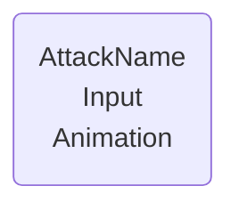
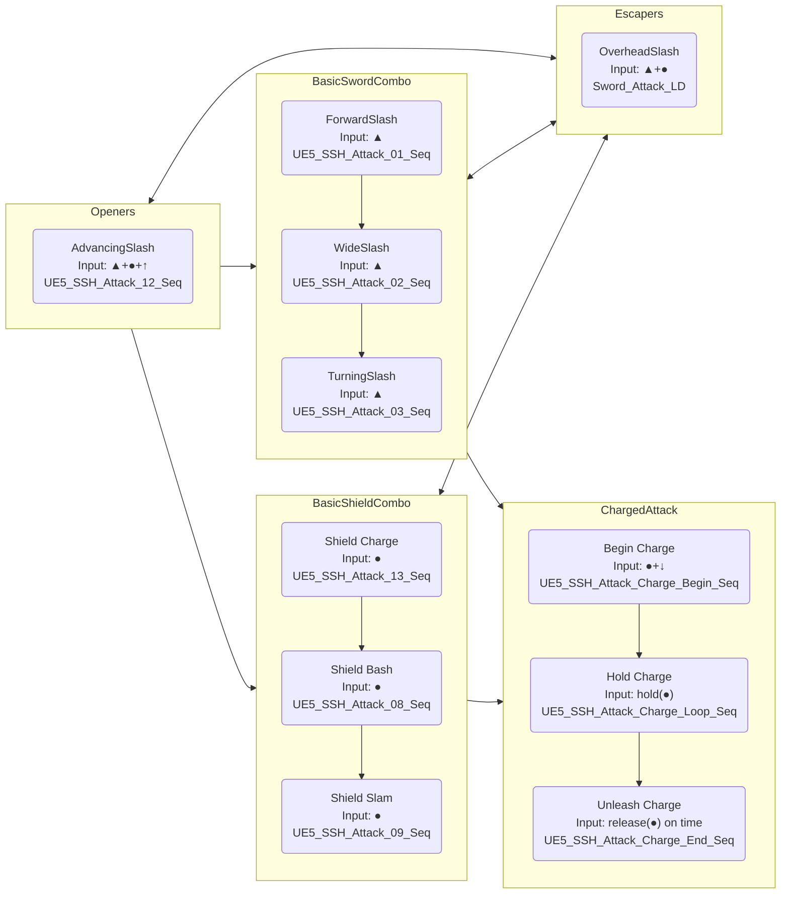

# Combat System

## Combo-chain

---

### Template



### MVP Combo chain


# AttemptCombo Function

## Overview

**Location:** BP_ThirdPersonCharacter Functions  
**Type:** Function  
**Purpose:** Handles all combo logic by querying data tables to determine valid attack transitions and executing the appropriate animation.

---

## Function Signature

**Input:**

- `InputAction` (E_InputAction enum) - The detected input from ProcessCombatInput()

**Output:**

- None (void function)

---

## Function Flow

### High-Level Logic
```
AttemptCombo(InputAction)
    ↓
Query DT_Combos for valid transition
    ↓
If valid transition found:
    ├─ Query DT_Attacks for animation data
    ├─ Play animation montage
    └─ Update combat state
```

---

## Detailed Implementation

### Step 1: State Check

**Branch: Is CurrentAttackName == None?**

- **True:** Character is in neutral state (not attacking)
  - Search for valid **starter moves** (FromAttack = None)
  
- **False:** Character is mid-combo
  - Search for valid **transitions** (FromAttack = CurrentAttackName)

Both paths lead to the same table query logic.

---

### Step 2: Query DT_Combos for Valid Transition

**Get Data Table Row Names** from `DT_Combos`
  ↓
**For Each Loop With Break** (iterate through all combo rows)
  ↓
For each row:

1. **Get Data Table Row** from `DT_Combos`
2. **Break S Combo Transition** (extract struct fields)
3. **Check conditions** (AND node):
   - `CurrentAttackName == FromAttack` (or both None for starters)
   - `InputAction (function input) == InputAction (table)`
4. **If BOTH TRUE:**
   - **Set local variable:** `FoundCombo = ToAttack`
   - **Break loop** (valid transition found, stop searching)

**Loop Completed** (all rows checked)
  ↓
**Branch: Is FoundCombo != None?**

---

### Step 3A: Valid Transition Found (FoundCombo != None)

**Get Data Table Row** from `DT_Attacks`

- Row Name: `FoundCombo`
  ↓
**Break S Attack Data** (extract attack properties)
  ↓
**Play Anim Montage**
- Anim to Play: `AttackMontage` (from struct)
  ↓
**Set CurrentAttackName** = `FoundCombo`
  ↓
**Set bCanCombo** = False (prevent input until combo window opens via ANS)
  ↓
**Return**

---

### Step 3B: No Valid Transition (FoundCombo == None)

**Do nothing** (invalid input for current state)
  ↓
**Return**

---

## Data Table Dependencies

### DT_Combos (Combo Transitions)

| Column | Type | Description |
|--------|------|-------------|
| FromAttack | E_AttackName | Starting attack (None = neutral state) |
| ToAttack | E_AttackName | Resulting attack |
| InputAction | E_InputAction | Required input to trigger transition |

**Example Rows:**
```
None → ForwardSlash (LightAttack)           // Neutral starter
ForwardSlash → WideSlash (LightAttack)      // Combo continuation
ForwardSlash → OverheadSlash (LightAndHeavy) // Escaper transition
```

---

### DT_Attacks (Attack Properties)

| Column | Type | Description |
|--------|------|-------------|
| AttackName | E_AttackName | Unique attack identifier |
| AttackMontage | Anim Montage | Animation to play |
| BaseDamage | Float | Attack damage value |
| AttackType | Enum | Attack category |
| ... | ... | (other attack properties) |

---

## State Variables Used

| Variable | Type | Read/Write | Purpose |
|----------|------|------------|---------|
| `CurrentAttackName` | E_AttackName | Read/Write | Tracks active attack for transition queries |
| `bCanCombo` | Boolean | Write | Prevents input spam (reset by ANS_ComboWindow) |
| `FoundCombo` | E_AttackName (Local) | Read/Write | Stores valid transition result |

---

## Integration with Input System

**Call Flow:**
```
Event Tick (if bInputReceivedThisFrame)
    ↓
ProcessCombatInput() → Returns E_InputAction
    ↓
AttemptCombo(DetectedInput)
    ↓
Queries tables → Plays attack
```

**Guard Conditions** (checked before AttemptCombo is called):

- `(CurrentAttackName == None) OR (bCanCombo == True)`
- Prevents invalid combo attempts outside combo windows

---

## Design Patterns

### Data-Driven Architecture

**All combo logic lives in data tables**, not Blueprint:

- ✅ Add new attacks: Add row to DT_Attacks
- ✅ Add new transitions: Add row to DT_Combos
- ✅ Modify combos: Edit table rows (no code changes)
- ✅ Balance damage: Update DT_Attacks values

### Normalized Structure

**Separation of concerns:**

- **DT_Combos:** "Which attacks connect?"
- **DT_Attacks:** "What are the attack properties?"

No data duplication - attack properties stored once in DT_Attacks.

### Early Exit Pattern

**For Each Loop With Break** stops searching once valid transition is found:

- ✅ Performance: Doesn't check every row unnecessarily
- ✅ Clarity: First valid match wins (priority by row order)

---

## Example Execution Traces

### Example 1: Basic Combo from Neutral

**Input:** Player presses Tri from neutral
```
AttemptCombo(LightAttack)
├─ CurrentAttackName = None (neutral)
├─ Query DT_Combos:
│   └─ Find: None → ForwardSlash (LightAttack) ✓
├─ FoundCombo = ForwardSlash
├─ Query DT_Attacks:
│   └─ Get ForwardSlash properties (AM_Slash_01)
├─ Play Anim Montage: AM_Slash_01
├─ Set CurrentAttackName = ForwardSlash
└─ Set bCanCombo = False
```

**Result:** ForwardSlash animation plays, combo window opens via ANS

---

### Example 2: Combo Continuation

**Input:** Player presses Tri during ForwardSlash combo window

**Precondition:** ANS_ComboWindow set bCanCombo = True
```
AttemptCombo(LightAttack)
├─ CurrentAttackName = ForwardSlash (mid-combo)
├─ Query DT_Combos:
│   └─ Find: ForwardSlash → WideSlash (LightAttack) ✓
├─ FoundCombo = WideSlash
├─ Query DT_Attacks:
│   └─ Get WideSlash properties (AM_Slash_02)
├─ Play Anim Montage: AM_Slash_02
├─ Set CurrentAttackName = WideSlash
└─ Set bCanCombo = False
```

**Result:** Combo continues to WideSlash

---

### Example 3: Escaper (Flow Connector)

**Input:** Player presses Tri+Circle during WideSlash combo window
```
AttemptCombo(LightAndHeavy)
├─ CurrentAttackName = WideSlash
├─ Query DT_Combos:
│   └─ Find: WideSlash → OverheadSlash (LightAndHeavy) ✓
├─ FoundCombo = OverheadSlash
├─ Play Anim Montage: AM_OverheadSlash
├─ Set CurrentAttackName = OverheadSlash
└─ Set bCanCombo = False
```

**Result:** Transitions to OverheadSlash (escaper attack)

---

### Example 4: Invalid Input (No Valid Transition)

**Input:** Player presses Circle during ForwardSlash

**Assume:** No transition exists from ForwardSlash with HeavyAttack input
```
AttemptCombo(HeavyAttack)
├─ CurrentAttackName = ForwardSlash
├─ Query DT_Combos:
│   └─ Loop through all rows
│   └─ No match found (no ForwardSlash → X with HeavyAttack)
├─ FoundCombo = None
└─ Return (do nothing)
```

**Result:** Input ignored, current attack continues

---

## Future Expansion Points

### Easy to Add:

**New Attacks:**

1. Add row to DT_Attacks with new AttackName
2. Add animation montage reference
3. Add transitions in DT_Combos

**New Input Types:**

1. Add to E_InputAction enum
2. Add detection logic in ProcessCombatInput()
3. Add combo rows using new input

**Conditional Transitions:**

- Could add "RequiredState" column to DT_Combos
- Check additional conditions (stamina, buffs, etc.)

### Scalability Considerations:

**Multiple Weapons:**

- Create DT_Combos_SnS, DT_Combos_GreatSword, etc.
- Query active weapon's table
- Share DT_Attacks (attacks could be weapon-agnostic)

**Context-Sensitive Combos:**

- Add "ContextTags" column (Airborne, LowHealth, etc.)
- Check context before allowing transition
- Enables situational attacks

---

## Common Issues & Solutions

### Issue: Combo doesn't continue

**Check:**

- Is `bCanCombo = True`? (ANS_ComboWindow must set this)
- Does transition exist in DT_Combos?
- Is InputAction enum value correct?
- Is CurrentAttackName being cleared prematurely?

---

### Issue: Wrong attack plays

**Check:**

- Row order in DT_Combos (first match wins)
- FromAttack and InputAction values match expected
- No duplicate rows causing wrong match

---

### Issue: Attack plays but CurrentAttackName not updated

**Check:**

- Set CurrentAttackName node is connected
- Using FoundCombo value (not hardcoded)
- No logic bypassing the Set node

---

## Performance Notes

**Function Cost:** Very low (~0.01ms per call)

**Bottlenecks:**

- For Each Loop: O(n) where n = rows in DT_Combos
- Typically 20-50 rows = negligible cost
- Breaks early on match (doesn't check all rows)

**Optimization (if needed in future):**

- Use Map/Dictionary for O(1) lookup instead of linear search
- Hash key: "FromAttack_InputAction" → ToAttack
- Only necessary if 100+ combo rows

---

## Design Philosophy

**This function embodies the project's architectural principles:**

✅ **Data-driven:** Logic in tables, not code  
✅ **Single Responsibility:** Only handles combo logic  
✅ **Scalable:** Easy to add attacks/transitions  
✅ **Readable:** Clear linear flow  
✅ **Debuggable:** Print FoundCombo to see what matched

**Inspired by:** Fighting game input systems, Monster Hunter combo architecture

---

## Related Systems

**Upstream (calls this function):**

- `ProcessCombatInput()` - Detects input and calls AttemptCombo

**Downstream (called by this function):**

- Anim Montage playback system
- ANS_ComboWindow (sets bCanCombo during animations)
- ANS_ClearAttackName (resets CurrentAttackName at animation end)

**Parallel Systems (independent):**

- Perfect Timing System (reads CurrentAttackName, doesn't modify)
- Surface Material System (triggers on attack connect)
- Lock-On Camera (independent of combo state)

---

*Documented: Session 9 - Abstract Input System & Combo Refactor*  
*For: Future Claude sessions and Solo Dev Reference*