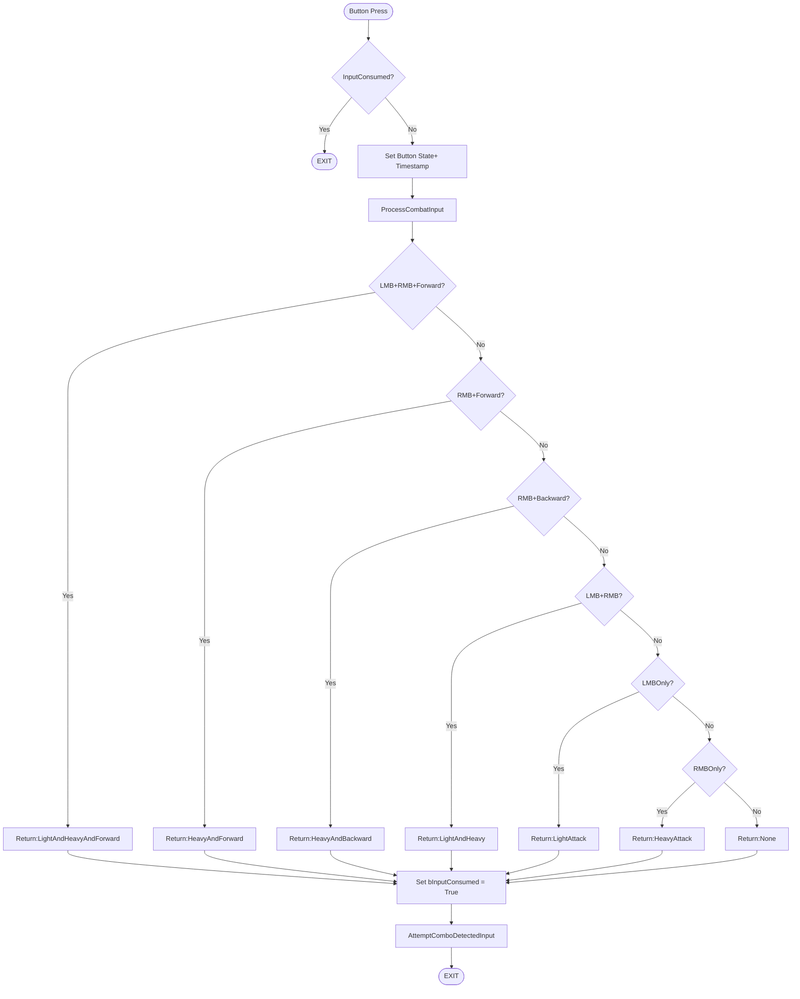

# Abstract Input System

## Overview

**Status:** ✅ Complete  
**Session:** 9  
**Purpose:** Controller-agnostic input detection supporting complex combo inputs including simultaneous presses, directional modifiers, and hold mechanics.

---

## Architecture

### Core Design Philosophy

The system uses a **priority-based waterfall detection** pattern that checks input combinations from most specific (3 inputs) to least specific (1 input). This ensures complex inputs are never accidentally interpreted as simpler ones.

**Example:** LMB+RMB+Forward is checked BEFORE LMB+Forward, preventing the player from accidentally triggering a basic opener when attempting the triple input.

---

## Components

### Input Actions (Enhanced Input System)

Located in: `/Input/Actions/`

**Combat Inputs:**

- `IA_LightAttack` - Triangle/Y/LMB
- `IA_HeavyAttack` - Circle/B/RMB
- `IA_Block` - R2/RT/Shift (placeholder for future)

**Movement Inputs (existing):**

- `IA_Move` - WASD/Left Stick
- `IA_Look` - Mouse/Right Stick

### Input Mapping Context

Located in: `/Input/IMC_Default`

Maps abstract actions to physical buttons across all supported controllers:

- **Keyboard/Mouse:** LMB, RMB, E, R, Shift
- **PlayStation:** Triangle, Circle, Square, X, L1, R1
- **Xbox:** Y, B, X, A, LB, RB

---

## Variables

**Category: Input Detection**
stored in E_InputActions enumerable

| Variable | Type | Purpose |
|----------|------|---------|
| `bLightPressed` | Boolean | Is Light Attack currently held? |
| `bHeavyPressed` | Boolean | Is Heavy Attack currently held? |
| `LightPressTime` | Float | Game time when Light was pressed |
| `HeavyPressTime` | Float | Game time when Heavy was pressed |
| `LastMoveInputTime` | Float | Game time when last movement input occurred |
| `bInputConsumed` | Boolean | Has this frame's input been processed? |
| `SimultaneousWindow` | Float | Time window for detecting simultaneous button presses (default: 0.15s) |
| `DirectionalWindow` | Float | Time window for detecting directional modifiers (default: 0.15s) |

**Reused from Movement System:**

- `LastMoveForward` (Float) - Forward/Backward input value (-1 to 1)
- `LastMoveRight` (Float) - Left/Right input value (-1 to 1)

---

## Input Detection Priority

The `ProcessCombatInput()` function checks inputs in this order:

### Priority 1: Triple Inputs (Highest)

1. **LMB+RMB+Forward** → `LightAndHeavyAndForward`
   - Conditions: Both buttons pressed within 0.15s + Forward input within 0.15s

### Priority 2: Directional Modifiers

2. **RMB+Forward** → `HeavyAndForward`
   - Conditions: Heavy pressed + Forward input within 0.15s
3. **RMB+Backward** → `HeavyAndBackward`
   - Conditions: Heavy pressed + Backward input within 0.15s

### Priority 3: Simultaneous Buttons

4. **LMB+RMB** → `LightAndHeavy`
   - Conditions: Both pressed within 0.15s of each other

### Priority 4: Single Buttons

5. **LMB** → `LightAttack`
6. **RMB** → `HeavyAttack`

### Priority 5: Fallback

7. **None** → No valid input detected

---

## Flow Diagram



---

## Implementation Details

### State Tracking (Event Graph)

**IA_LightAttack → Started:**

```
1. Branch: Is bInputConsumed? → If True, EXIT
2. Set bLightPressed = True
3. Get Game Time → Set LightPressTime
4. Call ProcessCombatInput() → returns DetectedInput
5. Set bInputConsumed = True
6. Call AttemptCombo(DetectedInput)
```

**IA_LightAttack → Completed:**

```
1. Set bLightPressed = False
```

**IA_HeavyAttack:** (Same pattern as Light)

**IA_Move:**

```
1. Move Character (existing logic)
2. Set LastMoveForward
3. Set LastMoveRight
4. Get Game Time → Set LastMoveInputTime
```

**Event Tick:**

```
1. Set bInputConsumed = False (reset for next frame)
```

### ProcessCombatInput Function

**Location:** BP_ThirdPersonCharacter Functions  
**Type:** Function (not Event, requires return value)  
**Returns:** E_InputAction enum

**Logic Pattern:**
Each check follows this structure:

1. Build condition (AND node with all requirements)
2. Branch on condition
3. If True → Return appropriate enum value (exits function)
4. If False → Continue to next check

**Example Check (LMB+RMB):**

```
AND (all must be true):
├─ bLightPressed == True
├─ bHeavyPressed == True
└─ abs(LightPressTime - HeavyPressTime) < SimultaneousWindow

If True → Return "LightAndHeavy"
If False → Continue to next check
```

---

## Timing Windows

### SimultaneousWindow (0.15 seconds)

**Purpose:** Determines how close together button presses must be to register as simultaneous.

**Tuning Guidance:**

- **Too tight (< 0.1s):** Players struggle to execute, feels unresponsive
- **Too loose (> 0.2s):** Accidental simultaneous inputs, feels imprecise
- **Current (0.15s):** Industry standard, works for most players

### DirectionalWindow (0.15 seconds)

**Purpose:** Determines how recent movement input must be to combine with attacks.

**Tuning Guidance:**

- **Too tight:** Player must press exactly simultaneously, frustrating
- **Too loose:** Stale inputs trigger wrong moves
- **Current (0.15s):** Allows "move then attack" feel while preventing false positives

---

## Integration with Combo System

The detected input enum flows into the existing combo system:

```
ProcessCombatInput()
    ↓ (returns E_InputAction)
AttemptCombo(InputAction)
    ↓
Query DT_Combos for valid transition
    ↓
Execute attack if transition exists
```

**No changes required to AttemptCombo() function** - it already accepts E_InputAction parameter.

---

## E_InputAction Enum

**Location:** (wherever your enums are stored)

**Values:**

- `LightAttack` - Basic sword combo trigger
- `HeavyAttack` - Basic shield combo trigger
- `LightAndHeavy` - Escaper/Flow connector
- `LightAndHeavyAndForward` - Triple input opener
- `HeavyAndForward` - Advancing Bash opener
- `HeavyAndBackward` - Charge attack initiation
- `None` - No valid input detected (should not trigger combos)

---

## Testing & Debugging

### Debug Outputs

**Recommended Debug Print Strings:**

1. **In ProcessCombatInput (at top):**

```
   Print: "Light: {bLightPressed} | Heavy: {bHeavyPressed} | Forward: {LastMoveForward}"
```

2. **Before each Return Node:**

```
   Print: "Detected Input: [InputType]"
```

3. **In AttemptCombo:**

```
   Print: "Attempting Combo with Input: {InputAction}"
```

### Common Issues & Solutions

**Issue:** Simultaneous inputs not detecting

- **Check:** Are both `bPressed` variables True?
- **Check:** Is `abs(LightPressTime - HeavyPressTime)` actually < 0.15?
- **Solution:** Print the time difference to verify

**Issue:** Directional inputs triggering when not moving

- **Check:** Is `LastMoveInputTime` being updated in IA_Move?
- **Check:** Is `LastMoveForward` at the expected value (> 0.5 or < -0.5)?
- **Solution:** Print movement timestamp delta

**Issue:** Wrong priority executing (e.g., LMB+Forward when pressing LMB+RMB+Forward)

- **Check:** Verify checks are in correct priority order
- **Check:** Ensure each True branch EXITS (Return node)
- **Solution:** Add Print String at each check to see which fires

**Issue:** Inputs triggering twice in one frame

- **Check:** Is `bInputConsumed` being set after ProcessCombatInput?
- **Check:** Is Event Tick resetting `bInputConsumed` each frame?
- **Solution:** Print consumed flag state

---

## Performance Considerations

**Frame Cost:** Negligible (~0.01ms per input)

The system executes once per button press and uses:

- Simple boolean checks (extremely fast)
- Float comparisons (fast)
- Early exits (prevents unnecessary checks)
- No loops, no array operations

**Optimization Notes:**

- Could cache `Get Game Time in Seconds` at function start (micro-optimization)
- Current implementation prioritizes readability over micro-performance
- Suitable for 60fps/120fps gameplay with no performance impact

---

## Future Expansion

### Easy to Add

- **LMB+Backward** - Add check before LMB only
- **Hold detection** - Track button hold duration, add to priority checks
- **Release timing** - Perfect release mechanic (already used in Charge Attack)
- **Triple directional** - LMB+RMB+Backward (same pattern as Forward version)

### Integration Points

- **Block state** - Add IA_Block handling (same Started/Completed pattern)
- **Dodge cancel** - Check `bIsDodging` before processing attacks
- **Animation locks** - Add state checks to prevent input during certain animations

### Scalability

System handles arbitrary complexity by adding checks in priority order. Maximum theoretical inputs with current windows: ~10-12 distinct combinations before becoming unplayable for humans.

---

## Design Rationale

### Why Priority Waterfall?

**Alternative Considered:** State machine with explicit transitions

- **Rejected:** Too rigid, hard to add new combos
- **Chosen approach:** More flexible, easier to tune timing windows

### Why Time Windows Instead of Frame-Perfect?

**Design Goal:** Accessible to average players, not just fighting game experts

- 0.15s window = ~9 frames at 60fps
- Allows human reaction time variance
- Feels responsive without being too lenient

### Why Centralized Detection?

**Alternative Considered:** Duplicate logic in each input event

- **Rejected:** Maintenance nightmare, priority conflicts
- **Chosen approach:** Single source of truth, easy to debug

---

## Lessons Learned

1. **Abstract early:** Starting with controller-specific inputs (LMB/RMB) was technical debt paid back in Session 9
2. **Time-based windows > Frame-based:** More consistent across different frame rates
3. **Priority order matters:** Most specific first prevents accidental simple inputs
4. **Functions > Events for logic:** Need return values for clean architecture
5. **Input consumed flag essential:** Prevents double-execution on same frame

---

## Credits & Inspiration

**Input buffer system inspired by:**

- Monster Hunter series (directional modifiers, deliberate inputs)
- Fighting games (simultaneous detection, time windows)
- Devil May Cry (priority-based combo detection)

**Architectural pattern:** Time-windowed input buffering (industry standard for action games)

---
